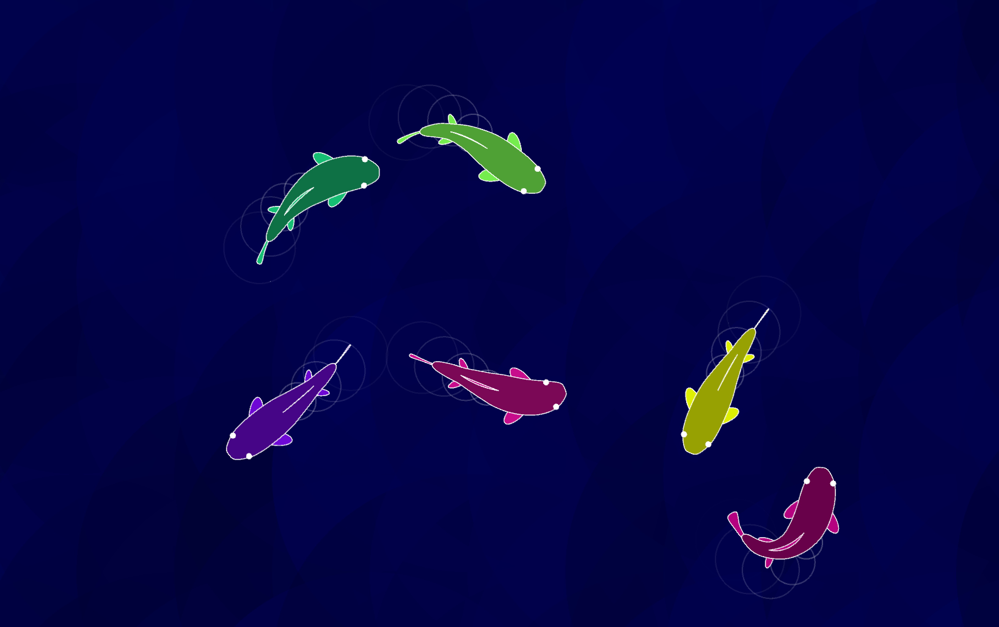

# Chillfish

Fish swimming aimlessly around, intended to be used on a second monitor for relaxation while working on something else.

Procedural animation of a fish based on the code by argonautcode (https://github.com/argonautcode/animal-proc-anim)
Uses a 2D chain simulation for rigging.

